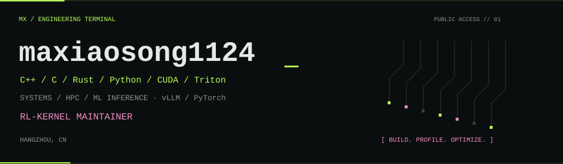
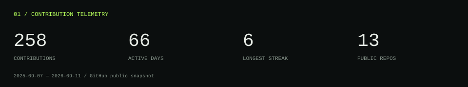
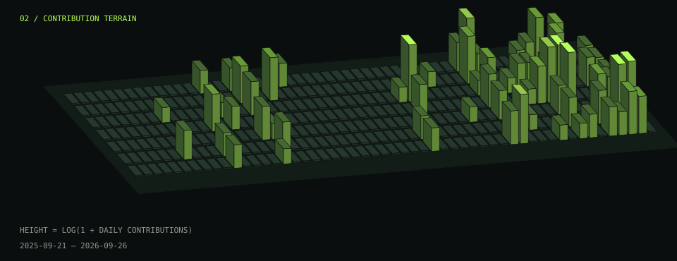
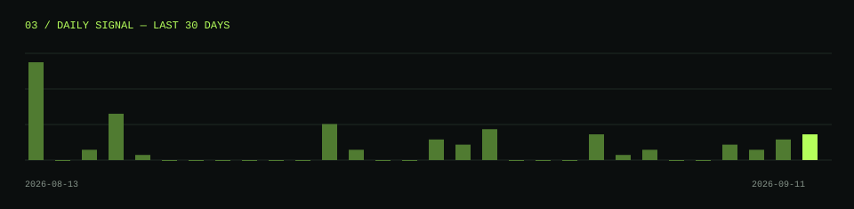

### [进入交互主页 / Open Interactive Terminal ↗](https://maxiaosong1124.github.io/maxiaosong1124/)

[GitHub](https://github.com/maxiaosong1124) · [Email](mailto:maxiaosong1234@outlook.com) · Hangzhou, CN

**[RL-Kernel Core Contributor](https://github.com/RL-Align/RL-Kernel)**

### 00 / 个人介绍 · About Me

我一直从事 Linux 系统与内核驱动开发、高并发通信架构设计、区块链密码学算法的 HPC 算子开发，以及机器学习推理系统的开发与性能优化。此外，我也曾从事自动驾驶通信架构开发、规划与控制算法开发，以及相关系统的性能优化。

业余时间，我也持续探索 LLM 推理、训练与强化学习（RL）相关技术。

My work spans Linux systems and kernel driver development, highly concurrent communication architectures, HPC kernels for blockchain cryptographic algorithms, and the development and performance optimization of machine learning inference systems. Previously, I developed communication architectures and planning and control algorithms for autonomous driving, and optimized the performance of these systems.

In my spare time, I also explore LLM inference, training, and reinforcement learning (RL).

**技术栈 / Tech stack**：C++ · C · Rust · Python · CUDA · Triton

**熟悉的框架 / Familiar frameworks**：vLLM · PyTorch

**当前学习方向 / Currently learning**

目前正在学习 RL 后训练的相关算法与框架，包括 vime、miles，以及训练框架 Megatron；同时深入探索集群通信、RDMA 通信，以及 Triton、LLVM、MLIR 等编译器相关技术。

I am currently studying algorithms and frameworks for RL-based post-training, including vime and miles, as well as the Megatron training framework. I am also exploring cluster communication, RDMA, and compiler technologies such as Triton, LLVM, and MLIR.

**未来愿景 / Future vision**

未来，我将持续深耕系统性能优化领域，致力于打造追求极致性能的基础设施，覆盖 LLM、RL、自动驾驶与传统系统，并努力成长为系统性能优化领域的专家。

I will continue to focus on systems performance optimization, building infrastructure that pushes performance to its limits across LLMs, reinforcement learning, autonomous driving, and traditional systems. My long-term goal is to become an expert in systems performance optimization.

### 04 / Open Source Contributions

| Project | Contribution |
| :--- | :--- |
| [RL-Align/RL-Kernel](https://github.com/RL-Align/RL-Kernel/issues?q=author%3Amaxiaosong1124) | CORE CONTRIBUTOR |
| [vllm-project/vllm](https://github.com/vllm-project/vllm/issues?q=author%3Amaxiaosong1124) | PUBLIC CONTRIBUTIONS |

#### Featured Repositories

- [ncu-cuda-profiling-skill](https://github.com/maxiaosong1124/ncu-cuda-profiling-skill) · **126 stars** — let coding agents  use ncu skills analysis cuda program automatically!

### 05 / Recent Activity

| Date (UTC) | Activity | Project |
| :--- | :--- | :--- |
| 2026-09-10 | [merged pull request #402](https://github.com/RL-Align/RL-Kernel/pull/402) | RL-Align/RL-Kernel |
| 2026-09-10 | [opened pull request #402](https://github.com/RL-Align/RL-Kernel/pull/402) | RL-Align/RL-Kernel |
| 2026-09-10 | [reviewed pull request #401](https://github.com/RL-Align/RL-Kernel/pull/401#pullrequestreview-5165404783) | RL-Align/RL-Kernel |
| 2026-09-10 | [reviewed pull request #400](https://github.com/RL-Align/RL-Kernel/pull/400#pullrequestreview-5165187323) | RL-Align/RL-Kernel |
| 2026-09-09 | [reviewed pull request #396](https://github.com/RL-Align/RL-Kernel/pull/396#pullrequestreview-5156827822) | RL-Align/RL-Kernel |
| 2026-09-09 | [reviewed pull request #394](https://github.com/RL-Align/RL-Kernel/pull/394#pullrequestreview-5156796518) | RL-Align/RL-Kernel |
| 2026-09-08 | [reviewed pull request #393](https://github.com/RL-Align/RL-Kernel/pull/393#pullrequestreview-5142785338) | RL-Align/RL-Kernel |
| 2026-09-08 | [reviewed pull request #390](https://github.com/RL-Align/RL-Kernel/pull/390#pullrequestreview-5138720328) | RL-Align/RL-Kernel |

---

Public data snapshot: 2026-09-11T05:52:02+00:00. Activity is limited to the latest 100 public events; it is not a complete contribution history.
